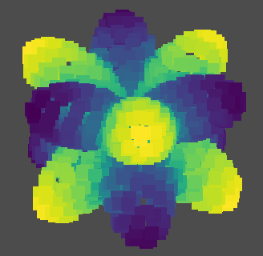

# EasyPDE

EasyPDE is a python package designed for solving partial differential equations (PDEs). It's unbelievably easy to use, but powerful, providing a continuous solution for solving not only linear but also nonlinear PDEs in complex shapes in 2D as well as 3D space, or even surfaces.

You no longer need to care about mesh generation, which can be a big problem itself for some messy geometries. This is because the algorithm is designed for solving PDEs based on only points scattered in the domain. On the other hand, you don't need to calculate integrates in elements like you did in FEM any more.

What's more, it's extremely easy to fix boundary conditions. You can do this in a continuous way as in the domain. For example, if you want to require $\partial u/\partial x$ equals to something, or you want to require this on boundary, the code is same! Don't worry about the order of error. It's typically of second order.

Enjoy writing less code and get solutions you want!

## Basic Example: Solving Laplacian Equation

Assume you have a domain $\Omega$, which is a unit disk. You want to solve the following PDE with Dirichlet boundary condition: $\nabla^2 u = 0$,

$$
u\bigg|_{\partial \Omega}=\cos \theta,
$$

where $\partial \Omega$ means boundary of $\Omega$, namely a circle in this case. You can easily solve the problem numerically with EasyPDE.

```python
import numpy as np
import easypde
```

In EasyPDE, you need points in the domain and on the boundary for solving. You'll get numerical solution in the form of function values on each point. The points can be completely randomly chosen. But uniform distribution works better. Now you scatter approximately 400 points on the disk with `scatter_points_on_disk`.

```python
# Generate points in a disk
# np.random.seed(0)  # Uncomment this line if you want the result be same every time you run your code.
points = easypde.pointcloud.scatter_points_on_disk(400)

# Visualize points
easypde.plot_points(points)
```


The random numbers are generated by `np.random` internal. So if you want to make sure the results are same every time you run your code, just use `np.random.seed(0)`.

There is a similar function, `scatter_points_on_square`, which can scatter points in a square. For more complicated shapes, see section Generate Point Cloud.

Now you need to convert the problem into a linear system, namely a matrix $A$ and a vector $b$. Then you can solve $A x=b$ to get the solution $x$. You initialize $A$ and $b$ as zero, and use `edit_A_and_b` to fill them with correct things.

```python
A = np.zeros((len(points), len(points)))
b = np.zeros(len(points))
weight_distribution_radius = easypde.pointcloud.get_typical_distance(points)*0.1  # a parameter for calculating the matrix

for i, point in enumerate(points):
    x = point[0]
    y = point[1]
    
    if x**2+y**2>0.999:  # On boundary
        a = np.arctan2(x, y)
        easypde.edit_A_and_b(i, A, b, points, point,
                             5,  # number of neighbours for calculation
                             [1, 0, 0, 0, 0, 0],  # differential operator
                             value=np.cos(a*4),
                             weight_distribution_radius=weight_distribution_radius)
    else:  # Internal
        easypde.edit_A_and_b(i, A, b, points, point,
                             16,  # number of neighbours for calculation
                             [0, 0, 0, 1, 0, 1],  # differential operator
                             weight_distribution_radius=weight_distribution_radius)
```

You may have noticed the funny way to define the differential operator, where `[a0, a1, a2, a3, a4, a5]` means the operator $a_0+a_1 \frac {\partial}{\partial x}+a_2 \frac {\partial}{\partial y}+a_3 \frac {\partial^2}{\partial x^2}+a_4 \frac {\partial^2}{\partial x \partial y}+a_5 \frac {\partial^2}{\partial y^2}$. So `[1, 0, 0, 0, 0, 0]` is used for defining the identity operator, which only return the original function without doing anything. And `[0, 0, 0, 1, 0, 1]` means $\frac {\partial^2}{\partial x^2}+\frac {\partial^2}{\partial y^2}$, which is $\nabla^2$.

Then you can solve the linear system. The result is a 1d numpy array with length equals to the number of points. It's the list of function values of the numerical solution on each point.

```python
solution = np.linalg.solve(A, b)
```

You can plot it with any package you want, such as `matplotlib.pyplot`, which is frequently used, or more simply, with `plot_points` provided by EasyPDE.

```python
easypde.plot_points(points, field=solution)
```


How about Neumann boundary conditions, where you require $\partial u/ \partial n$, the normal derivative, equals to something on boundary? Consider the following problem: $\nabla^2 u = \sin 15 x$,

$$
\frac {\partial u} {\partial n} \bigg|_{\partial \Omega} = 0.
$$

Notice that at the boundary of unit disk, the normal direction is simply $(x, y)$. So the operator for $\partial u/ \partial n$ can be wrote as `[0, x, y, 0, 0, 0]`.

The code is as follows, where you use a more density point cloud for finer result.

```python
points = easypde.pointcloud.scatter_points_on_disk(1000)

A = np.zeros((len(points), len(points)))
b = np.zeros(len(points))
weight_distribution_radius = easypde.pointcloud.get_typical_distance(points)*0.1
for i, point in enumerate(points[:-1]):  # The last point skiped.
    x = point[0]
    y = point[1]
    if x**2+y**2>0.999:  # On boundary
        a = np.arctan2(x, y)
        easypde.edit_A_and_b(i, A, b, points, point, 5, [0, x, y, 0, 0, 0],
                             weight_distribution_radius=weight_distribution_radius)
    else:  # Internal
        easypde.edit_A_and_b(i, A, b, points, point, 16, [0, 0, 0, 1, 0, 1],
                             value=np.sin(15*x),
                             weight_distribution_radius=weight_distribution_radius)
A[-1] = np.ones_like(A[-1])

solution = np.linalg.solve(A, b)

easypde.plot_points(points, field=solution)
```


Note that problems with pure Neumann boundary conditions like the above one have multiple solutions, for adding a const to a solution results in another solution. As a result, the matrix $A$ is singular. To fix this, I treat the last row differently. I assigned 1 for every element of the last row, while leaving the last element of $b$  0. This fix the mean value of solution to 0. 

You can see a interesting phenomenon in the figure: curves of peak of wave tried to get perpendicular to the boundary, which is clearly result of the Neumann boundary condition.

## Generate Point Cloud

This section is a inspirational tutorial, showing how can user point clouds for EasyPDE.

Essentially speaking, in EasyPDE, you only need location of points to describe the domain. You can define the points in any way you like. The follow example scatter points in a triangle $\Omega := \{ (x, y)| x<1 \text{ and } y>0 \text{ and } y<x \}$, which is like


Clearly you can generate a grid and delete the upper part with pure NumPy.

```python
points = np.mgrid[0:1:20j, 0:1:20j].T.reshape([-1, 2])
points = points[points[:, 1]<=points[:, 0]]

easypde.plot_points(points)
```


If you solve $\nabla^2 u = 1$, $u\bigg|_{\partial \Omega}=0$ by

```python
# Solve
A = np.zeros((len(points), len(points)))
b = np.zeros(len(points))
weight_distribution_radius = easypde.pointcloud.get_typical_distance(points)*0.1
for i, point in enumerate(points):
    x = point[0]
    y = point[1]
    if if x==1 or y==0 or x==y::  # On boundary
        a = np.arctan2(x, y)
        easypde.edit_A_and_b(i, A, b, points, point, 5, [1, 0, 0, 0, 0, 0],
                             weight_distribution_radius=weight_distribution_radius)
    else:  # Internal
        easypde.edit_A_and_b(i, A, b, points, point, 16, [0, 0, 0, 1, 0, 1],
                             value=1,
                             weight_distribution_radius=weight_distribution_radius)
solution = np.linalg.solve(A, b)

# Visualize
easypde.plot_points(points, field=solution)
```

you get the expected solution:


But you can do this that easily only because the geometry is extremally simple. For general cases, you have to scatter points in the domain.  

Firstly you should write a function, whose input is a numpy array of points, output is a boolean array, indicating whether each point is in the domain.

```python
# Define a function, determining whether each point is in the domain.
def in_domain(points):
    return np.logical_and(np.logical_and(points[:, 0]<=1, points[:, 1]>=0),
                           points[:, 0]>=points[:, 1])
```

For example, $(0.5, 0.25)$ is in $\Omega$, while $(0.5, 0.75)$ not. Run

```python
in_domain(np.array([[0.5, 0.25], [0.5, 0.75]]))
```

The result should be `array([ True, False])`.

The following code scatters points randomly with pure numpy.

```python
# Generate boundary_points and internal_points

boundary_points = []
for t in np.linspace(0, 1, 19, endpoint=False):
    boundary_points.append([t, 0])
    boundary_points.append([1, t])
for t in np.linspace(0, 1, int(19*np.sqrt(2)), endpoint=False):
    boundary_points.append([1-t, 1-t])
    
internal_points = np.random.rand(400, 2)
internal_points = internal_points[in_domain(internal_points)]  # Delete points out domain
```

```python
points = np.concatenate([boundary_points, internal_points])  # Simply join them

easypde.plot_points(points)  # Visualize
```


The result looks not uniform. But you are luck. EasyPDE can work on this!

You can solve and get your solution:


The result is nice.

We can also do something to make the point cloud more proper. You can use `relax_points`, which relaxes points by simulating that they repel each other.

```python
# Generate boundary_points and internal_points (... same code as before)

points = easypde.pointcloud.relax_points(boundary_points, internal_points, 1/20)
points = points[in_domain(points)]  # Delete points went out the domain.

# Solve (... same code as before)

# Visualize (... same code as before)
```


As an alternative method, you can use `relax_points_voronoi`, which relaxes points by moving each point to the center of its Voronoi cell and repeating this modification for several times. This usually provides a little better results but takes a little more time.

```python
# Generate boundary_points and internal_points (... same code as before)

points = easypde.pointcloud.relax_points_voronoi(boundary_points, internal_points, in_domain)

# Solve (... same code as before)

# Visualize (... same code as before)
```


## 3D Example

$\Omega=(0, 1)^3$, $\nabla^2 u = 1$, $u\bigg|_{\partial \Omega}=0$.

```python
points = np.mgrid[0:1:10j, 0:1:10j, 0:1:10j].T.reshape([-1, 3])

easypde.plot_points(points, point_size=17)
```

A new window should open, showing a 3D cube. You can rotate it with your mouse. This feature is based on PyVista.


You can solve and visualize the solution in the same way. The only difference is that the definition of differential operators now have 10 items, because its the combination of  $1$, $ \frac {\partial}{\partial x}$, $ \frac {\partial}{\partial y}$, $\frac {\partial}{\partial z}$, $\frac {\partial^2}{\partial x^2}$, $\frac {\partial^2}{\partial y^2}$, $\frac {\partial^2}{\partial z^2}$, $ \frac {\partial^2}{\partial x \partial y}$, $ \frac {\partial^2}{\partial y \partial z}$, $ \frac {\partial^2}{\partial x \partial z}$.

```python
A = np.zeros((len(points), len(points)))
b = np.zeros(len(points))
weight_distribution_radius = easypde.pointcloud.get_typical_distance(points)*0.1
for i, point in enumerate(points):
    x = point[0]
    y = point[1]
    z = point[2]
    if x==0 or x==1 or y==0 or y==1 or z==0 or z==1:  # On boundary
        a = np.arctan2(x, y)
        easypde.edit_A_and_b(i, A, b, points, point, 7, [1, 0, 0, 0, 0, 0, 0, 0, 0, 0],
                             weight_distribution_radius=weight_distribution_radius,
                             space_type="3d")
    else:  # Internal
        easypde.edit_A_and_b(i, A, b, points, point, 27, [0, 0, 0, 0, 1, 1, 1, 0, 0, 0],
                             value=1,
                             weight_distribution_radius=weight_distribution_radius,
                             space_type="3d")

solution = np.linalg.solve(A, b)

easypde.plot_points(points[:500], field=solution[:500], point_size=17)
```


## Surface Example

In this section, we calculate eigenfunction of $\nabla^2$ on sphere. This problem is of great importance in quantum mechanics.

Let $\Omega=\{(x, y, z)|x^2+y^2+z^2=1\}$. Eigenfunctions on sphere can be very symmetric and beautiful. However, generally speaking, there are multiple eigenfunctions sharing same eigenvalues. It's bad for visualization, because a numerical result of a eigenfunction can be combination of several symmetric eigenfunctions, resulting in an asymmetric sum. Here, for convenience, we use a trick to avoid this trouble as much as possible. Instead of $\frac {\partial^2}{\partial x^2}+\frac {\partial^2}{\partial y^2}+\frac {\partial^2}{\partial z^2}$, we calculate eigenvalues of $\frac {\partial^2}{\partial x^2}+\frac {\partial^2}{\partial y^2}+1.2\frac {\partial^2}{\partial z^2}$.

```python
# Scatter points on sphere.
points = np.random.randn(2000, 3)

# Relax the points.
for i in range(40):
    points += easypde.pointcloud.repulsive_force(points, points, 5./40, 10.)*0.01
    points /= np.sqrt(np.sum(np.square(points), axis=-1)).reshape((-1, 1))

# Fill matrix A.
A = np.zeros((len(points), len(points)))
weight_distribution_radius = easypde.pointcloud.get_typical_distance(points)*0.1
for i, point in enumerate(points):
    easypde.edit_A(i, A, points, point, 27, [0, 0, 0, 0, 1, 1, 1.2, 0, 0, 0],
                   weight_distribution_radius=weight_distribution_radius,
                   space_type="3d")

# Calculate eigenvalues and eigenvectors of A.
eig = np.linalg.eig(A)

# Visualize the 20th eigenvector.
eigenvector_id = 19
easypde.plot_points((points.T*np.abs(eig[1].T[np.lexsort([np.abs(eig[0])])[eigenvector_id]])).T,
                    field=np.real(eig[1].T[np.lexsort([np.abs(eig[0])])[eigenvector_id]]), point_size=17)
```


