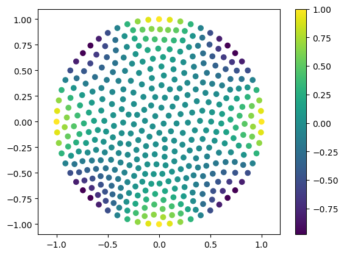
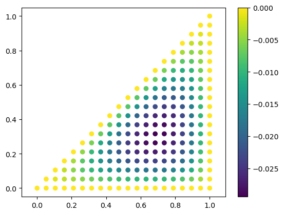
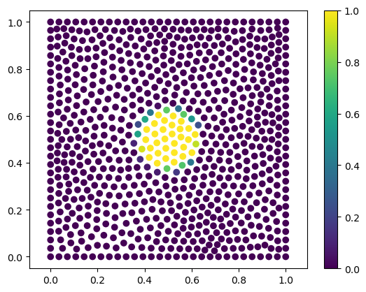
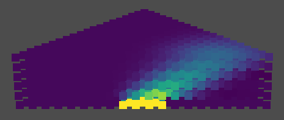

# EasyPDE

EasyPDE is a python package designed for solving partial differential equations (PDEs). It's unbelievably easy to use, but powerful, providing a continuous solution for solving not only linear but also nonlinear PDEs in complex shapes in 2D as well as 3D space, or even surfaces.

You no longer need to care about mesh generation, which can be a big problem itself for some messy geometries. This is because the algorithm is designed for working on only points scattered in the domain. This makes it extremely robust. On the other hand, you don't need to calculate integrates in elements like you did in FEM.

What's more, it's extremely easy to fix boundary conditions. You can do this in a continuous way as in the domain. For example, if you want to require $\partial u/\partial x$ equals to something, or you want to require this on boundary, the code is same! Don't worry about the order of error. It's typically of second order.

Enjoy writing less code and get solutions you want!

## Install

```
$ pip install easypde
```

## Basic Example: Solving Laplacian Equation

### Solve

Assume you have a domain $\Omega$, which is a unit disk. You want to solve the following PDE with Dirichlet boundary condition: $\nabla^2 u = 0$, $u\bigg|_{\partial \Omega}=\cos 4\theta$, where $\partial \Omega$ means boundary of $\Omega$, namely a circle in this case. You can easily solve the problem numerically with EasyPDE.

```python
import numpy as np
import easypde
```

In EasyPDE, you need points in the domain and on the boundary for solving. You'll get numerical solution in the form of function values on each point. The points can be completely randomly chosen. But uniform distribution works better. Now you scatter approximately 400 points on the disk with `scatter_points_on_disk`.

```python
# Generate points in a disk
# np.random.seed(0)  # Uncomment this line if you want the result be same every time you run your code.
points = easypde.pointcloud.scatter_points_on_disk(400)

# Visualize points
easypde.plot_points(points)
```


The random numbers are generated by `np.random` internal. So if you want to make sure the results are same every time you run your code, just use `np.random.seed(0)`.

There is 2 similar functions, `scatter_points_on_square` and `scatter_points_on_rectangle`, which can scatter points in a square or rectangle. For more complicated shapes, see section Generate Point Cloud.

Now you need to convert the problem into a linear system, namely a matrix $A$ and a vector $b$. Then you can solve $A x=b$ to get the solution $x$. You initialize $A$ and $b$ as zero, and use `edit_A_and_b` to fill them with correct things.

```python
A = np.zeros((len(points), len(points)))
b = np.zeros(len(points))
weight_distribution_radius = easypde.pointcloud.get_typical_distance(points)*0.1  # a parameter for calculating the matrix

for i, point in enumerate(points):
    x = point[0]
    y = point[1]
    
    if x**2+y**2>0.999:  # On boundary
        a = np.arctan2(x, y)
        easypde.edit_A_and_b(i, A, b, points, point,
                             5,  # number of neighbours for calculation
                             [1, 0, 0, 0, 0, 0],  # differential operator
                             value=np.cos(a*4),
                             weight_distribution_radius=weight_distribution_radius)
    else:  # Internal
        easypde.edit_A_and_b(i, A, b, points, point,
                             16,  # number of neighbours for calculation
                             [0, 0, 0, 1, 0, 1],  # differential operator
                             weight_distribution_radius=weight_distribution_radius)
```

You may have noticed the funny way to define the differential operator, where `[a0, a1, a2, a3, a4, a5]` means the operator $a_0+a_1 \frac {\partial}{\partial x}+a_2 \frac {\partial}{\partial y}+a_3 \frac {\partial^2}{\partial x^2}+a_4 \frac {\partial^2}{\partial x \partial y}+a_5 \frac {\partial^2}{\partial y^2}$. So `[1, 0, 0, 0, 0, 0]` is used for defining the identity operator, which only return the original function without doing anything. And `[0, 0, 0, 1, 0, 1]` means $\frac {\partial^2}{\partial x^2}+\frac {\partial^2}{\partial y^2}$, which is $\nabla^2$.

Then you can solve the linear system. The result is a 1d numpy array with length equals to the number of points. It's the list of function values of the numerical solution on each point.

```python
solution = np.linalg.solve(A, b)
```

You can plot it with any package you want, such as `matplotlib.pyplot`, which is frequently used, or more simply, with `plot_points` provided by EasyPDE.

```python
easypde.plot_points(points, field=solution)
```



The operator `[0, 0, 0, 1, 0, 1]` in the above code can be replaced by a more compact form, which uses predefined differential operators `'laplacian'`:

```python
easypde.edit_A_and_b(i, A, b, points, point,
                     16,  # number of neighbours for calculation
                     'laplacian',  # differential operator
                     weight_distribution_radius=weight_distribution_radius)
```

### Error Analysis

Let's compare it with the analytical solution $u = r^4 \cos 4 \theta$. Let's calculate root mean square (RMS) of the difference as $error$.

```python
r = np.sqrt(np.sum(np.square(points), axis=-1))
a = np.arctan2(points[:, 0], points[:, 1])
ground_truth = r**4*np.cos(4*a)
print(np.sqrt(np.mean(np.square(solution-ground_truth))))
```

The RMS I got is $4.9\times 10^{-4}$. It may me a little different on your computer due to randomness introduced at the step of point cloud generation.

Then you can try a finer point could with about 4 times points, resulting in about half distance between points.

```python
points = easypde.pointcloud.scatter_points_on_disk(1600)

A = np.zeros((len(points), len(points)))
b = np.zeros(len(points))
weight_distribution_radius = easypde.pointcloud.get_typical_distance(points)*0.1
for i, point in enumerate(points):
    x = point[0]
    y = point[1]
    if x**2+y**2>0.999:  # On boundary
        a = np.arctan2(x, y)
        easypde.edit_A_and_b(i, A, b, points, point, 5, [1, 0, 0, 0, 0, 0],
                             value=np.cos(a*4),
                             weight_distribution_radius=weight_distribution_radius)
    else:  # Internal
        easypde.edit_A_and_b(i, A, b, points, point, 16, [0, 0, 0, 1, 0, 1],
                             weight_distribution_radius=weight_distribution_radius)

solution = np.linalg.solve(A, b)

r = np.sqrt(np.sum(np.square(points), axis=-1))
a = np.arctan2(points[:, 0], points[:, 1])
ground_truth = r**4*np.cos(4*a)
np.sqrt(np.mean(np.square(solution-ground_truth)))
```

The RMS I got is $9.4\times 10^{-5}$. The $order$ of a numerical solutions is defined by $error\sim h^{order}$, where $h$ is the typical size of elements, here the distance of points. So the method here is of 2nd order. 

### Visualize Matrix

For better visibility of patterns, we use less, namely 40, points for demonstration.

```python
points = easypde.pointcloud.scatter_points_on_disk(400)

# All thins same.

easypde.plot_matrix(A)
```


### Neumann Boundary Conditions

How about Neumann boundary conditions, where you require $\partial u/ \partial n$, the normal derivative, equals to something on boundary? Consider the following problem: $\nabla^2 u = \sin 15 x$, $\frac {\partial u} {\partial n} \bigg|_{\partial \Omega} = 0$. Notice that at the boundary of unit disk, the normal direction is simply $(x, y)$. So the operator for $\partial u/ \partial n$ can be wrote as `[0, x, y, 0, 0, 0]`.

The code is as follows, where you use a more density point cloud for finer result.

```python
points = easypde.pointcloud.scatter_points_on_disk(1000)

A = np.zeros((len(points), len(points)))
b = np.zeros(len(points))
weight_distribution_radius = easypde.pointcloud.get_typical_distance(points)*0.1
for i, point in enumerate(points[:-1]):  # The last point skiped.
    x = point[0]
    y = point[1]
    if x**2+y**2>0.999:  # On boundary
        a = np.arctan2(x, y)
        easypde.edit_A_and_b(i, A, b, points, point, 5, [0, x, y, 0, 0, 0],
                             weight_distribution_radius=weight_distribution_radius)
    else:  # Internal
        easypde.edit_A_and_b(i, A, b, points, point, 16, [0, 0, 0, 1, 0, 1],
                             value=np.sin(15*x),
                             weight_distribution_radius=weight_distribution_radius)
A[-1] = np.ones_like(A[-1])

solution = np.linalg.solve(A, b)

easypde.plot_points(points, field=solution)
```


Note that problems with pure Neumann boundary conditions like the above one have multiple solutions, for adding a const to a solution results in another solution. As a result, the matrix $A$ is singular. To fix this, I treat the last row differently. I assigned 1 for every element of the last row, while leaving the last element of $b$  0. This fix the mean value of solution to 0. 

You can see a interesting phenomenon in the figure: curves of peak of wave tried to get perpendicular to the boundary, which is clearly result of the Neumann boundary condition.

## Generate Custom Point Clouds

This section is a inspirational tutorial, showing how can user generate custom point clouds for EasyPDE.

For very simple shapes, namely disks and rectangles, simply use `scatter_points_on_disk`, `scatter_points_on_square` and `scatter_points_on_rectangle`. The rest of this section focus on more complicated shapes.

Essentially speaking, in EasyPDE, you only need location of points to describe the domain. You can define the points in any way you like. The follow example scatter points in a triangle $\Omega :=${$ (x, y)| x \lt 1 \text{ and } y \gt 0 \text{ and } y \lt x$}, which is like


Clearly you can generate a grid and delete the upper part with pure NumPy.

```python
points = np.mgrid[0:1:20j, 0:1:20j].T.reshape([-1, 2])
points = points[points[:, 1]<=points[:, 0]]

easypde.plot_points(points)
```


If you solve $\nabla^2 u = 1$, $u\bigg|_{\partial \Omega}=0$ by

```python
# Solve
A = np.zeros((len(points), len(points)))
b = np.zeros(len(points))
weight_distribution_radius = easypde.pointcloud.get_typical_distance(points)*0.1
for i, point in enumerate(points):
    x = point[0]
    y = point[1]
    if if x==1 or y==0 or x==y::  # On boundary
        a = np.arctan2(x, y)
        easypde.edit_A_and_b(i, A, b, points, point, 5, [1, 0, 0, 0, 0, 0],
                             weight_distribution_radius=weight_distribution_radius)
    else:  # Internal
        easypde.edit_A_and_b(i, A, b, points, point, 16, [0, 0, 0, 1, 0, 1],
                             value=1,
                             weight_distribution_radius=weight_distribution_radius)
solution = np.linalg.solve(A, b)

# Visualize
easypde.plot_points(points, field=solution)
```

you get the expected solution:



But you can do this that easily only because the geometry is extremally simple. For general cases, you have to scatter points in the domain.  

Firstly you should write a function, whose input is a numpy array of points, output is a boolean array, indicating whether each point is in the domain.

```python
# Define a function, determining whether each point is in the domain.
def in_domain(points):
    return np.logical_and(np.logical_and(points[:, 0]<=1, points[:, 1]>=0),
                           points[:, 0]>=points[:, 1])
```

For example, $(0.5, 0.25)$ is in $\Omega$, while $(0.5, 0.75)$ not. Run

```python
in_domain(np.array([[0.5, 0.25], [0.5, 0.75]]))
```

The result should be `array([ True, False])`.

The following code scatters points randomly with pure numpy. Code for solving and visualizing are completely same so being omitted.

```python
# Generate boundary_points and internal_points

boundary_points = []
for t in np.linspace(0, 1, 19, endpoint=False):
    boundary_points.append([t, 0])
    boundary_points.append([1, t])
for t in np.linspace(0, 1, int(19*np.sqrt(2)), endpoint=False):
    boundary_points.append([1-t, 1-t])
    
internal_points = np.random.rand(400, 2)
internal_points = internal_points[in_domain(internal_points)]  # Delete points out domain

points = np.concatenate([boundary_points, internal_points])  # Simply join them

# Code for solving

# Code for visualizing
```


Although the point cloud is not uniform, EasyPDE does work on this!

We can also do something to make the point cloud more proper. You can use `relax_points`, which relaxes points by simulating that they repel each other.

```python
# Generate boundary_points and internal_points (... same code as before)

points = easypde.pointcloud.relax_points(boundary_points, internal_points, 1/20)
points = points[in_domain(points)]  # Delete points went out the domain.

# Solve (... same code as before)

# Visualize (... same code as before)
```


As an alternative method, you can use `relax_points_voronoi`, which relaxes points by moving each point to the center of its Voronoi cell and repeating this modification for several times. This usually provides a little better results but takes a little more time.

```python
# Generate boundary_points and internal_points (... same code as before)

points = easypde.pointcloud.relax_points_voronoi(boundary_points, internal_points, in_domain)

# Solve (... same code as before)

# Visualize (... same code as before)
```


## Visualization

As you have seen, you can use `easypde.plot_points` for visualizing. It automatically choose 2D or 3D methods depending on the input data.

### Color

#### Use Original RGB values

In case you have an `rgb` which is an array containing RGB values for each point. It's size must be `(len(points), 3)`. You can use option `field=rgb` to directly visualize RGB color.

#### Use Color Map

Color maps are used if you have a field, which means you have a real or complex value for each point, and want to map the values to colors. A yellow-green-blue map is used by default.

You can use `color_map=...` in `easypde.plot_points` to assign a color map like you do in `plt` with `camp=...`. For example

```python
easypde.plot_points(points, field=u, color_map='hsv')  # Visualize value as hue
```

Apart from maps in `plt`, EasyPDE offers a new one, `'complex_hsv'`, for complex values. By using that, you can visualize $\text{Arg } f(z)$ as hue and $|f(z)|$ as brightness.

### Point Size

You can set point size in `easypde.plot_points` by thing like `point_size=10`.

You can option `adaptive_point_size=True` to make point size adapt to the density of points cloud where each point locate. This feature induce additional computing cost. This feature on support 2D visualization.

## 3D Example

$\Omega=(0, 1)^3$, $\nabla^2 u = 1$, $u\bigg|_{\partial \Omega}=0$.

```python
points = np.mgrid[0:1:10j, 0:1:10j, 0:1:10j].T.reshape([-1, 3])

easypde.plot_points(points, point_size=17)
```

A new window should open, showing a 3D cube. You can rotate it with your mouse. This feature is based on PyVista.


You can solve and visualize the solution in the same way. The only difference is that the definition of differential operators now have 10 items, because its the combination of  $1$, $ \frac {\partial}{\partial x}$, $ \frac {\partial}{\partial y}$, $\frac {\partial}{\partial z}$, $\frac {\partial^2}{\partial x^2}$, $ \frac {\partial^2}{\partial x \partial y}$, $ \frac {\partial^2}{\partial x \partial z}$, $\frac {\partial^2}{\partial y^2}$, $ \frac {\partial^2}{\partial y \partial z}$, $\frac {\partial^2}{\partial z^2}$.

Be careful of the order. Use `easypde.get_operators` to get a list of operators.

```python
easypde.get_operators(3, 2, axis_names=['x', 'y', 'z'])
# Result: ['', 'x', 'y', 'z', 'xx', 'xy', 'xz', 'yy', 'yz', 'zz']
```

The code for solving this PDE is as follows.

```python
A = np.zeros((len(points), len(points)))
b = np.zeros(len(points))
weight_distribution_radius = easypde.pointcloud.get_typical_distance(points)*0.1
for i, point in enumerate(points):
    x = point[0]
    y = point[1]
    z = point[2]
    if x==0 or x==1 or y==0 or y==1 or z==0 or z==1:  # On boundary
        a = np.arctan2(x, y)
        easypde.edit_A_and_b(i, A, b, points, point, 7, [1, 0, 0, 0, 0, 0, 0, 0, 0, 0],
                             weight_distribution_radius=weight_distribution_radius)
    else:  # Internal
        easypde.edit_A_and_b(i, A, b, points, point, 27, [0, 0, 0, 0, 1, 0, 0, 1, 0, 1],
                             value=1,
                             weight_distribution_radius=weight_distribution_radius)

solution = np.linalg.solve(A, b)

# Visualize solution on half of the box
easypde.plot_points(points[:500], field=solution[:500], point_size=17)
```


## Surface Example

In this section, we calculate eigenfunction of $\nabla^2$ on sphere. This problem is of great importance in quantum mechanics.

Let $\Omega=${$(x, y, z)|x^2+y^2+z^2=1$}. Eigenfunctions on sphere can be very symmetric and beautiful. Turn to [Spherical harmonics - Wikipedia](https://en.wikipedia.org/wiki/Spherical_harmonics) for more introductions of these functions.

```python
# Scatter points on sphere.
np.random.seed(0)
points = np.random.randn(2000, 3)

# Relax the points.
for i in range(40):
    points += easypde.pointcloud.repulsive_force(points, points, 5./40, 10.)*0.01
    points /= np.sqrt(np.sum(np.square(points), axis=-1)).reshape((-1, 1))

# Fill matrix A.
np.random.seed(0)
A = np.zeros((len(points), len(points)))
weight_distribution_radius = easypde.pointcloud.get_typical_distance(points)*0.1
for i, point in enumerate(points):
    easypde.edit_A(i, A, points, point, 16, [0, 0, 0, 1, 0, 1],
                   weight_distribution_radius=weight_distribution_radius,
                   space_type='subspace', basis_of_subspace=easypde.math.get_perpendicular_subspace([point]))

# Calculate eigenvalues and eigenvectors of A.
eig = np.linalg.eig(A)

plt.plot(np.sort(np.abs(eig[0]))[:40], 'o')  # Plot eigenvalues.
```


Here we used the option`space_type='subspace'` and `basis_of_subspace=array([vectors])`, which define the subspace where the operators operate.  And we used `easypde.math.get_perpendicular_subspace` to generate the basis of the subspace, which is perpendicular to the vector $r$.

You can see the 1, 3, 5, 7, ... pattern of the eigenfunctions sharing same eigenvalues, which is a well-known character of spectrum of Laplacian on a sphere.

When you try to plot an eigenfunction by

```python
# Visualize the 22th eigenvector.
eigenvector_id = 21
easypde.plot_points((points.T*np.abs(eig[1].T[np.lexsort([np.abs(eig[0])])[eigenvector_id]])).T,
                    field=np.real(eig[1].T[np.lexsort([np.abs(eig[0])])[eigenvector_id]]), point_size=17)
```


We use absolute value of eigenfunction to morph the sphere to get better visualization.

The result is not symmetric at all. This is because the eigenfunctions sharing eigenvalue mixed. To get a more symmetric result, you can make the operator behave a little different in the longitude and latitude direction. You only need to change the "Fill matrix A" part of the above code.

```python
np.random.seed(0)
A = np.zeros((len(points), len(points)))
weight_distribution_radius = easypde.pointcloud.get_typical_distance(points)*0.1
for i, point in enumerate(points):
    easypde.edit_A(i, A, points, point, 16, [0, 0, 0, 1, 0, 1.1],
                   weight_distribution_radius=weight_distribution_radius,
                   space_type='subspace', basis_of_subspace=easypde.math.get_perpendicular_subspace([point], guide_directions=[[0, 0, 1]]))
```


## ODE Example

Here we solve convection-diffusion equation $\frac {\partial u} {\partial t}=-v\cdot \nabla u+\mu \nabla^2 u$, where $v=(1, 1)$ and $\mu=0.03$.

```python
points = easypde.pointcloud.scatter_points_on_square(800)

# Define u at t=0
u = np.clip(30*(0.15-np.sqrt(np.sum(np.square(points-np.array([0.5, 0.5])), axis=-1))), 0, 1)

easypde.plot_points(points, field=u)
```



```python
A = np.zeros((len(points), len(points)))
weight_distribution_radius = easypde.pointcloud.get_typical_distance(points)*0.1
for i, point in enumerate(points):
    x = point[0]
    y = point[1]
    easypde.edit_A(i, A, points, point, 16, [0, -1, -1, 0.03, 0, 0.03],
                   weight_distribution_radius=weight_distribution_radius)

dt = 0.01
for step in range(30):
    u += A@u*dt  # 1-order Euler method

easypde.plot_points(points, field=u)
```


As you see, the round patch moves in the direction of $v$ and gets blur.

Let's do some interesting. If it's easy to define differential operators in EasyPDE, why not just treat the above 2D ODE problem as a 3D PDE problem? The operator should be $-v\cdot \nabla u-\frac {\partial u} {\partial t}+\mu \nabla^2 u$, which can be encoded as `[0, -1, -1, -1, 0.03, 0, 0, 0.03, 0, 0]`.

```python
points = np.mgrid[0:1:20j, 0:1:20j, 0:0.3:6j].T.reshape([-1, 3])

A = np.zeros((len(points), len(points)))
b = np.zeros(len(points))
weight_distribution_radius = easypde.pointcloud.get_typical_distance(points)*0.1
for i, point in enumerate(points):
    x = point[0]
    y = point[1]
    t = point[2]
    if t==0:
        easypde.edit_A_and_b(i, A, b, points, point, 7, [1, 0, 0, 0, 0, 0, 0, 0, 0, 0],
                             value=np.clip(30*(0.15-np.sqrt((x-0.5)**2+(y-0.5)**2)), 0, 1),  # u(x, 0)
                             weight_distribution_radius=weight_distribution_radius)
    else:
        easypde.edit_A_and_b(i, A, b, points, point, 27, [0, -1, -1, -1, 0.03, 0, 0, 0.03, 0, 0],
                             weight_distribution_radius=weight_distribution_radius)

solution = np.linalg.solve(A, b)

# Visualize solution on half of the box
visuable = points[:, 0]<=points[:, 1]
easypde.plot_points(points[visuable], field=solution[visuable], point_size=13)
```



The result is consistent with the previous one.

## Complex Functions Example

You can also use EasyPDE solving PDEs of complex Functions.

For a complex value function $f(x+i y)$, to require it as  a holomorphic function, we need Cauchy–Riemann equations: $\frac {\partial Re f}{\partial x} = \frac {\partial Im f}{\partial y}$ and $\frac {\partial Re f}{\partial y} = -\frac {\partial Im f}{\partial x}$, which equivalent to $\frac {\partial f}{\partial x} + i\frac {\partial f}{\partial y} = 0$. The differential operator $\frac {\partial}{\partial x} + i\frac {\partial}{\partial y}$ is wrote as `[0, 1, 1j, 0, 0, 0]` in EasyPDE. Let's solve a trivial problem, where we want to solve a holomorphic function $f(z)$ in a disk with $f\bigg|_{\partial \Omega}=z^2$.

```python
points = easypde.pointcloud.scatter_points_on_disk(400)

A = np.zeros((len(points), len(points)), dtype=np.complex64)
b = np.zeros(len(points), dtype=np.complex64)
weight_distribution_radius = easypde.pointcloud.get_typical_distance(points)*0.1
for i, point in enumerate(points):
    x = point[0]
    y = point[1]
    if x**2+y**2>0.999:  # On boundary
        easypde.edit_A_and_b(i, A, b, points, point, 5, [1, 0, 0, 0, 0, 0],
                             value=(x+y*1j)**2,
                             weight_distribution_radius=weight_distribution_radius,
                             dtype=np.complex64)
    else:  # Internal
        easypde.edit_A_and_b(i, A, b, points, point, 16, [0, 1, 1j, 0, 0, 0],
                             weight_distribution_radius=weight_distribution_radius,
                             dtype=np.complex64)

solution = np.linalg.solve(A, b)

easypde.plot_points(points, field=solution, color_map='complex_hsv')
```


Here we use a color function which maps $\text{Arg } f(z)$ to hue and $|f(z)|$ to brightness.

The we can calculate the error:

```python
np.sqrt(np.mean(np.square(np.abs(solution-(points[:, 0]+points[:, 1]*1j)**2))))
```

The error I got is $6.9\times 10^{-7}$. The numerical result is really satisfying.


## Vector Example

Consider a problem about static electric field: $\nabla\cdot \vec{E} = \rho(\vec{r}), \nabla\times \vec{E} = \vec{0}$, where $\vec{E}$ is the electric field and $\rho(\vec{r})$ is the source, namely the electric charge density, of the electric field. This can be solved by solving $\nabla^2 \phi = \rho(\vec{r})$ firstly and then calculate $\vec{E}$ by $\nabla \rho$. But here, we try to directly solve the PDE of vector field $\vec{E}$.

For simplicity we only consider the 2D case. We solve it in a disk of radius 1. Let $\rho$ be 1 in a region of radius 0.25 and be zero outside.

```python
np.random.seed(0)
points = easypde.pointcloud.scatter_points_on_disk(1000)

source_r = 0.25
source_blur = 0.02

# Prepare matrix
A = np.zeros((len(points)*2, len(points)*2))  # The vector field has 2 components, so sizes are multiplied by 2.
b = np.zeros(len(points)*2)
weight_distribution_radius = easypde.pointcloud.get_typical_distance(points)*0.1
for i, point in enumerate(points):
    r = np.sqrt(point[0]**2+point[1]**2)
    div = 1-max(0, min(1, (r-(source_r-source_blur))/(source_blur*2)))
    
    neighbors = easypde.pointcloud.find_closest_points(points, point, 16)
    # Here we precalculate the neighbors because this data will be used several times. This can save some time.
    
    easypde.edit_A_and_b(i, A, b, points, point, 16, [0, 1, 0, 0, 0, 0], value=div, neighbors=neighbors, row_channel=0, column_channel=0,
                         weight_distribution_radius=weight_distribution_radius)
    easypde.edit_A_and_b(i, A, b, points, point, 16, [0, 0, 1, 0, 0, 0], neighbors=neighbors, row_channel=0, column_channel=1,
                         weight_distribution_radius=weight_distribution_radius)
    easypde.edit_A_and_b(i, A, b, points, point, 16, [0, 0, 1, 0, 0, 0], neighbors=neighbors, row_channel=1, column_channel=0,
                         weight_distribution_radius=weight_distribution_radius)
    easypde.edit_A_and_b(i, A, b, points, point, 16, [0, -1, 0, 0, 0, 0], neighbors=neighbors, row_channel=1, column_channel=1,
                         weight_distribution_radius=weight_distribution_radius)

# Solve
solution = np.linalg.lstsq(A, b, rcond=1/40)[0]  # Calculate the least-squares solution
# Here we use np.linalg.lstsq instead of np.linalg.solve because the matrix is singular.
# The rcond parameter is critical. See NumPy's document about np.linalg.lstsq for more details.

# Visualize
easypde.plot_points(points, field=solution[:len(points)])  # Visualize the first component, namely E_x.
```


We compare the result with ground truth.

```python
r = np.sqrt(np.sum(np.square(points), axis=-1))
ground_truth =  np.array(points)
ground_truth = ground_truth.T
ground_truth[:, r>=source_r] *= r[r>=source_r]**-2*(np.pi*source_r**2/2/np.pi)*1
ground_truth[:, r<source_r] *= (np.pi*source_r**2/2/np.pi)/source_r/source_r
ground_truth = ground_truth.T
ground_truth = ground_truth.T.flatten()

print('error =', np.sqrt(np.mean(np.square(solution-ground_truth))))
# Result on my machine: error = 0.006351124477499586.
```

The error is acceptable.

The 4 `easypde.edit_A_and_b` in the above code can be replaced by a more compact form, which uses predefined vector differential operators `'div'` and `'curl'`:

```python
easypde.edit_A_and_b(i, A, b, points, point, None, 'div', value=div, neighbors=neighbors, row_channel=0, column_channel=0,
                     weight_distribution_radius=weight_distribution_radius)
easypde.edit_A_and_b(i, A, b, points, point, None, 'curl', neighbors=neighbors, row_channel=1, column_channel=0,
                     weight_distribution_radius=weight_distribution_radius)
```

